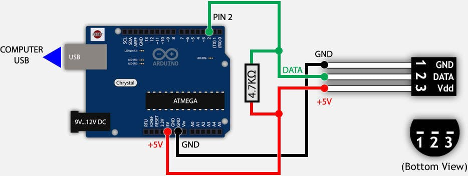

# Aquarium tank water temperature sensor
Using Arduino UNO and waterproof DS18B20 sensor to monitor water temperature in aquarium tank.

## Schematic


## Download Library
https://github.com/milesburton/Arduino-Temperature-Control-Library

## Arduino Code
```c
/********************************************************************/
// First we include the libraries
#include <OneWire.h> 
#include <DallasTemperature.h>
/********************************************************************/
// Data wire is plugged into pin 2 on the Arduino 
#define ONE_WIRE_BUS 2 
/********************************************************************/
// Setup a oneWire instance to communicate with any OneWire devices  
// (not just Maxim/Dallas temperature ICs) 
OneWire oneWire(ONE_WIRE_BUS); 
/********************************************************************/
// Pass our oneWire reference to Dallas Temperature. 
DallasTemperature sensors(&oneWire);
/********************************************************************/ 
void setup(void) 
{ 
 // start serial port 
 Serial.begin(9600); 
 Serial.println("Dallas Temperature IC Control Library Demo"); 
 // Start up the library 
 sensors.begin(); 
} 
void loop(void) 
{ 
 // call sensors.requestTemperatures() to issue a global temperature 
 // request to all devices on the bus 
/********************************************************************/
 Serial.print(" Requesting temperatures..."); 
 sensors.requestTemperatures(); // Send the command to get temperature readings 
 Serial.println("DONE"); 
/********************************************************************/
 Serial.print("Temperature is: "); 
 Serial.print(sensors.getTempCByIndex(0)); // Why "byIndex"?  
 // You can have more than one DS18B20 on the same bus.  
 // 0 refers to the first IC on the wire 
 delay(1000); 
} 
```

## DS18B20 Datasheet
https://datasheets.maximintegrated.com/en/ds/DS18B20.pdf
